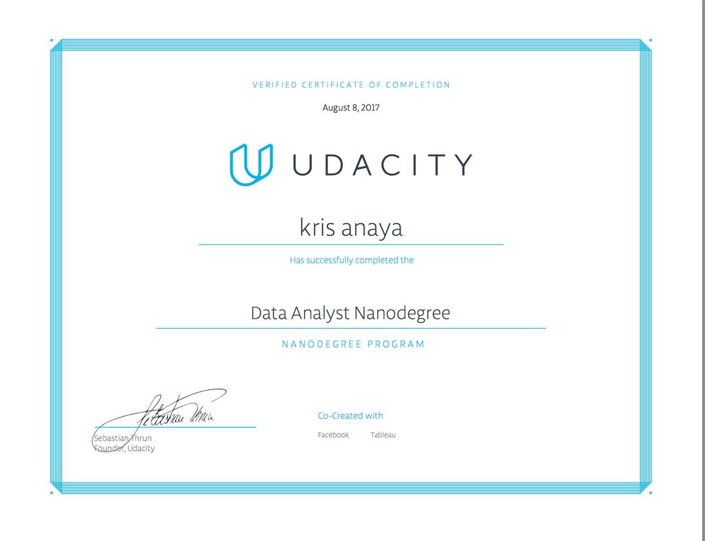

# udacity_data_analyst
my projects for the Udacity bootcamp class. 

## Project 1 (The Science of Decisions)
contains files on analyzing and identify the stroop effect using statistical analysis. 

## Project 2 (The Survivors and Victims on the Titanic)
Posed a question regarding this dataset, then performed analytics using Numpy and Pandas to 
answer the question based on the data. I was able to create an analytical report to share the 
results. 

## Project 3 (Open Stree Map Case Study)

Chose a region (Sacramento) and used data munging techniques to assess the quality of the 
data for validity, accuracy, completeness, consistency and uniformity. 

## Project 4 (EDA in R Bernie v. Trump Contributions in California)
This project is connected to the Data Analysis with R course. Primarily, it is the focus of analyzing the 2016 presidental election campaign contributions with canidate Bernie Sanders in my home state of California. I want to see average campaign contributions prices as well and county regions that donated more. Certain areas of California are primarly more conservative while other areas are more liberal. I want to see if contributions are greater or higher within these areas.

## Project 5 (Identify fraud from Enron email)

In 2000, Enron was one of the largest companies in the United States. By 2002, it had collapsed into bankruptcy due to widespread corporate fraud. In the resulting Federal investigation, a significant amount of typically confidential information entered into the public record, including tens of thousands of emails and detailed financial data for top executives. In this project, you will play detective, and put my skills to use by building a person of interest identifier based on financial and email data made public as a result of the Enron scandal. To assist my work i deployed sklearn, pickle, pandas and numpy to investigate and train my model.

## Project 6 (Create Simpsons visualization using Dimple.js)

Took some data from the Kaggle website and performed simple front-end data visualizations 
to represent and exploratory data analysis of the belovded seasons of the simpsons.

