## The Survivors and Viticms on the Titanic
The Titanic was set to port along the east coast of New York, however, on April 15,1912, more then 1,500 people lost their [lives](https://history.com/topics/titanic). Our objective was to investigate the survivors and vitcims who tragically lost their lives. 

We were given demographics and passenger information from **891** of the **2224** passangers and crew on board [Titanic Data](https://d17h27t6h515a5.cloudfront.net/topher/2016/September/57e9a84c_titanic-data/titanic-data.csv). We wish to ask the question: *what factors made people more likely to survive?* 

If you wish to view our source code for this ```python``` project please click [here](https://github.com/krismanaya/udacity_data_analyst/blob/master/project_2/titanic_src/Titanic%20Project%202%20.ipynb)

## What are the sample metrics? 
The Titanic data allows us to get a sample of the passangers who survived, class, name, sex, age, number of siblings; number of parents/children aboard, ticket number, passanger fare, cabin and where they embarked. Of the **891** passengers aboard we found that **38%** of passangers survived on the titanic at an average age of **24** years old. Mostly the survival was in the class 2 seating at an average fare of **$32**:

* **Survived** : **38%** 
* **Victims**  : **62%** 
* **Age**      : **24** 
* **Class**    : **2** 
  * First Class Survivors: **136**  
  * First Class Vicitims: **80** 
  * Second Class Survivors: **87**
  * Second Class Victims: **97** 
  * Third Class Survivors: **119** 
  * Third Class Victims: **372** 

* **Fare**     : **$32** 

## How many people survived and were victims by class? 
The most interesting insight (IMO) was there a better survival outcome based on socio-economic status? Given your position on the ship and sex what was the likely hood of your survival? However, we are still a bit limited how the survival and victim rate stook for most female and males.

### Survial and Victims by Class and Age: 
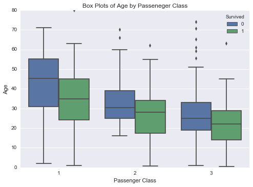

First let's investigate the passangers by age and class. It's easy to see regarding our boxplot above that the victim rate (denoted as **0**) for each class is set a bit higher by age then the passangers who survived (denoted as **1**). I was especially interested in the first class passanger median for the victims because it falls within the top third quartile of IQR for the passangers who survived. However, we are still a bit limited how the survival and victim rate stood out for most female and males.I'm pretty sure everybody has seen titanic and probably knows the scene "the women and children go first!" Could this in fact be a true possibility. Let's investigate deeper! 

### Male Survival & Male Victims: 
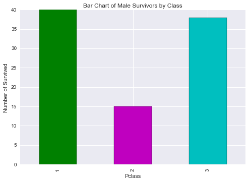
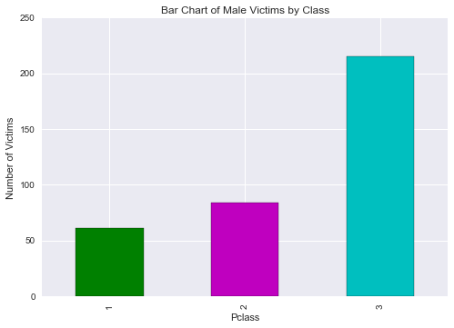

The histograms shows the sample population of **577** men who survived and were victims by each class. You may notice that first class males survived in a larger amount then were victims. Within the total sample poulation of males, first class men had **7.8%** percent chance of survival and a **13%** chance of death while, third class males had a **8.1%** chance of survival and a **52%** chance of death. 

### Female Survival & Female Victims: 
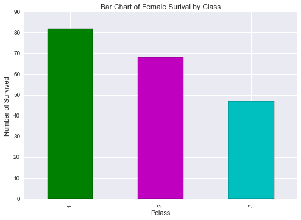
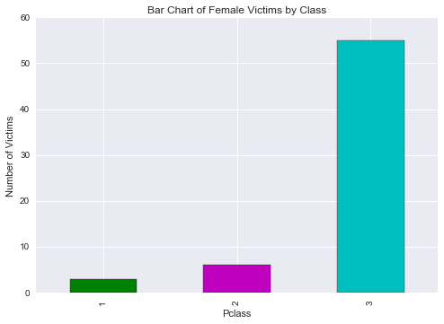

For the female histograms the total sample population of females were **314**. And as you can see from the visualization women had a better chance of survival. In fact, withint the total sample population of women on the Titanic, first class females had a **29%** chance of survival and only **1%** chance of death, while third class female passangers had **23%** chance of survival and a equal percantage of death. 


## Well what about the age of survival? 
Good question! We want to know what age status was most likely to survive based on the class let's analyze the results 

### Mean Age By Class for Males
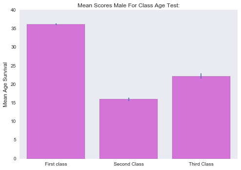 
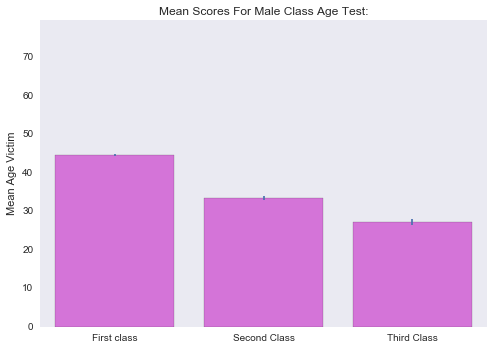 

For survival of first class passnagers the average was around **30** while for second class was below **15** and third class was around **18**.The data that pops out to me is the victims of the second class passangers. The age was roughly around **30** while most of the survivors in the second class were children. Thirty years of age is around the time people usually have  young children. 

### Mean Age by Class for Females
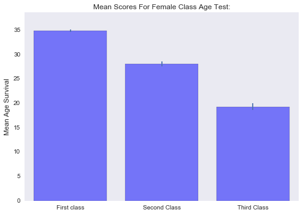 
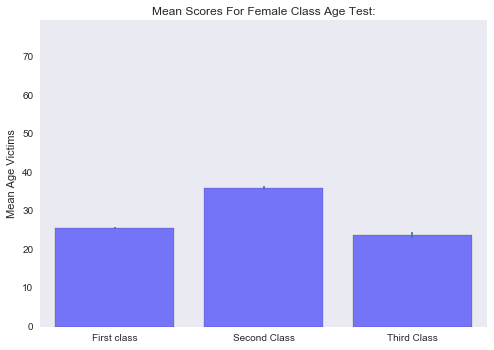

for Females, the data within the histogram that pops out to me the most survival and vitctim age for third class passagners falls around children to teenagers. It looks like the average age of a female victim in third class was around **19** or **20** years old. 


## So were you more likely to survive in first class? 
Personally, we believe you may have ahd a better chance of survival in as a first class passanger, however, there were in fact less first class passangers within our sample size. Let's look at the overall titanic survivors by class. 

### Titanic Survivors by Class

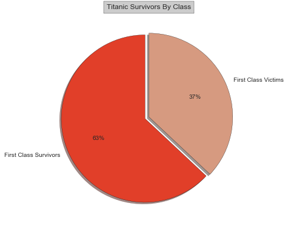 
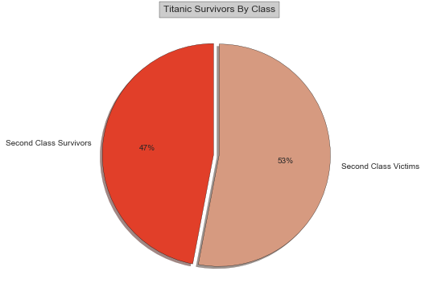 
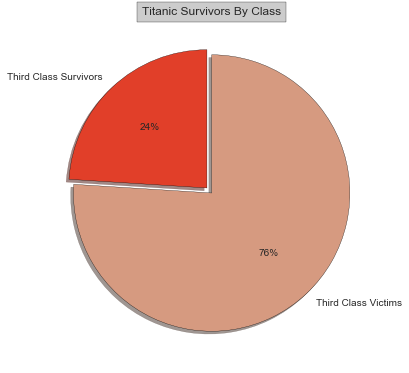 


Over each class group by viewing the pie charts **63%** of people in first class survived while **76%** of third class passangers fell victim to the Titanic tragedy. However, second class survivors were equally split between survivors and victims. Overall, this assumes that you may of had a better chance at survival. 

## Did it matter were you embarked and what about the fare? 
We wanted to see were the passangers embarked (Cherbourgh, Southampton, Queenstown) and the overall fare based on survivors and victims.


### Embarked and Fare of Survivors and Victims

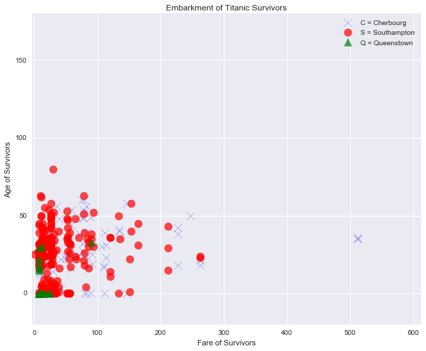 
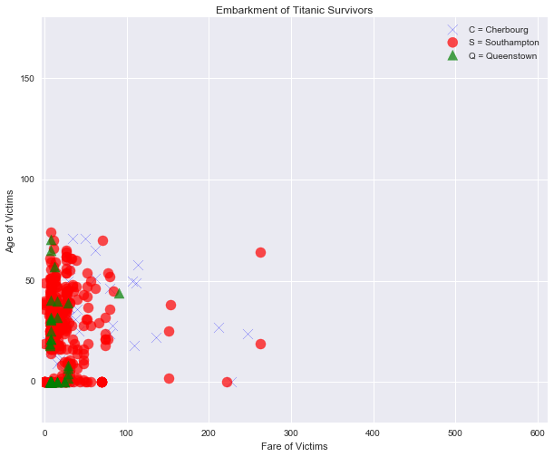 


### Survivors
The clustering of the survival data shows that most passangers were in between the age of zero to fifty and paid a vaired in payments between zero and one hundred doallars. There were three data points that stood out to me so I wanted to investigate. I looked at the maximum payment from the town Chdrbourg and saw that three people with no relation paid the same amount averaging at an age of **35**. Two of the passangers were male and one of the passangers were female. 


### Victims 
The clustering for the victim passangers was relatively similary, however, the age of the passangers increased so I wanted to investigate the victims who traveled from Southhampton. The average age of death was **24** years old with a and average fare of **21**. Since, I am interested in the class an age I looked at the maximum and minumum of the Southhampton passangers. The maximum age was a **74** year old male with passanger class 3. The passangers with the maximum fare rides were two male passangergs **19** and **64** with passanger class 1. 


## Was there any correlation between Fare and Class? 
We wanted to investigate the socio-economic status so we need to have some sort of correlation between class and fare. We calculated Spearman's rank correlation and plotted a fit regression to view our results. 

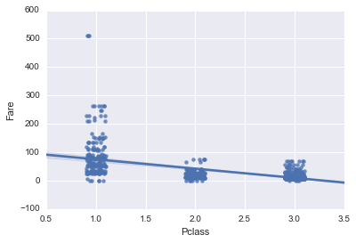

### Fare and Class
What we found was the the Spreaman correlation was **-0.69** a pretty good negative correlation. Meaning, as the fare increases the class descreases and we have shown that if you a passanger in class 1 you have more likely chance of survival especially if you are a female. 


### What is your conclusion? 

Well, in all does socio-economic status really play a role in your survival? The answer I would prescibe here is yes and no. While, you chance to greatly improve if you are a male in first class, overall, you may have the same chance of falling victim like third class passangers. However, this data changes if you are a female. Female's had a greater chance of survival if they were placed in the first class cabins. Lastly, another metric we could discover is the surival of children by vectorizing our pandas data set with passangers less then 18 and greater than or equal to zero. We are very limited in the amount of information we are given in this sample set. One limited thing is the NaN values which are set on the age. If we were given every age this might change the values a bit making them a smaller ager or larger average. This is beyond the scope of this project section but hopefully in further discussion we may be able to remedy this problem. Another down fall is the location of the passangers. We know what class the passangers were in but where is this located on the ship, what caused more passangers to die in third class? It might have something to do with location of the ship which we could watch from this [video](https://www.youtube.com/embed/FSGeskFzE0s). I would probably try to investiage a blue print of the titanic [ship](http://www.ultimatetitanic.com/design/#.WLSbWRiZMQ8) to see where the passangers could be staying and correlate that to the video where the ship split in half maybe this could have something to do with it. But for now, we are limited to the class factor. I encourage the readers to view the links above! Cheers ~ K 