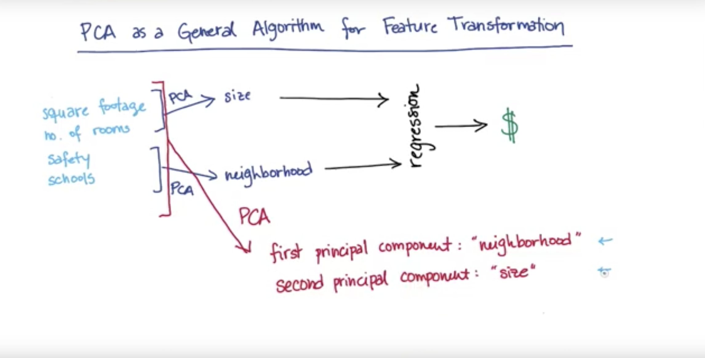

# Principal Component Analysis - PCA


PCA - if you are given data of any shape PCA finds a new coordinate system by translation and rotation it moves the x-axis into the most variation of the data points. 

 

essentially we create to vectors at the center of the data which are orthognal to each other.This is known as a transformation. Given two vectors $\vec{y}$ and $\vec{x}$ we must ensure that at some new point $P$ these vectors our orthognal $\vec{y} \perp \vec{x}$


## Measurable vs. Latent Features


question: given the features of a house, what is its price? this is a classic regression exercise so it's a conyinous which is a number as an output. 

** Measurable ** 
 - square footage 
 - no. of rooms 
 - school ranking 
 - neighborhood safety 

we arre proping two things (size, neighborhood) you can't measure directly but are drvigin the phenomenon behind the scene. 

** Latent ** 
 - size 
 - neighborhood 
 
question: How best to condense our 4 features to 2, so that we really get to the heart of the information? 

What's teh most suitable feature selection tool? 

* SelectKBest 
* SelectPercentile

You want to choose your $k$ number of features you would like to keep.

** Crucial Ingredients ** 
- Many features, but I hypothesize a smaller no. of featurse actually driving the patterns 
- Try making a **composite feature** that more directly probes the underlying phenomednon

## Example: Square Footage + No. Rooms -> Size 

 

Essentially, what is occuring in this image is a projection of that vector by creating new orthognal vectors along the line, creating a transformation of new points along the vector.

### How to determine the principal component. 

** Variance ** - the willingness / felxibility of an algorithm to learn (Machine Learning) 

** Variance (Stats) ** - roughly the "spread" of a data distribution $STD^{2}$. 

 

The longer line is goign to be the direction of maximum variance. ** Principal Component** of the data set is the direction that has thed ** Largest Variance ** because it retains maximum amount of "information" in the orginal data.

### Maximal Variance and information loss 

 
essentially, we want to creat a vector where the distance of the projection onto direction of maximal variance minimizes the distance from old (higher-dimensional) data point to its new transformed value. This in turn minimizes information loss. 


### PCA as a General Algorithm for feature transformation 


 

### Review / Definition of PCA 

- Systematized way to transform input features into principal components 
- use principal components as new features 
- PCs are directions in the data that maximize variance (minimize information loss) when you project / compress down onto them 
- more variance of data along a PC, higher than PC is ranked 
- most variance / most information --> first PC 
    - most variance (without overlapping w/ first PC) -- > Second PC
- max no. of PCs = no. of input features. 

### PCA in SKLEARN 

``` python
    def doPCA(): 
        from sklearn. decomposition import PCA 
        pca = PCA(n_components = 2) 
        pca.fit(data) 
        return pca 
    pca = doPCAA() # here it is folks. 
    print pca.explained_variance_ratio # explains its maximal variance eigenvalues 
    first_pc = pca.components_[0] # one component projection 
    second_pc = pca.components_[1] # second  . . . 
    
    transform_data = pca.transform(data) 
    for ii, jj in zip(transformed_data, data): 
        """This loop shows us what the transformed data is doing compared 
        to the original data set """
        
        plt.scatter(first_pc[0]*ii[0], first_pc[1]*ii[0], color = "r") 
        plt.scatter(second_pc[0]*ii[0], second_pc[1]*ii[0], color = "c") 
        plot.scatter(jj[0], jj[1], color = "b") 
    
```

 
As you can see from above we have some orthognality within the two vectors. 


### When to use PCA 

- Latent features driving the patterns in the data (big shots @ enron) 
- dimensionality reduction 
    - visualize high -dimensional data dim(3,4, . . ) proj down to 2 dims
    - reduce noise 
    - make other algorithms (regression, classification) 
      - word better b/c fewer inputs (eigenfaces) 


### PCA for Facial Recongnition 

** What makes facial recognition in pictures good for PCA**? 
- pictures of faces generally have high input dimensions / many pixels 
- faces have general patterns that could be captured in smaller number of dimensions 


#### EigenFaces Code 

``` eigenfaces.py ``` in src code