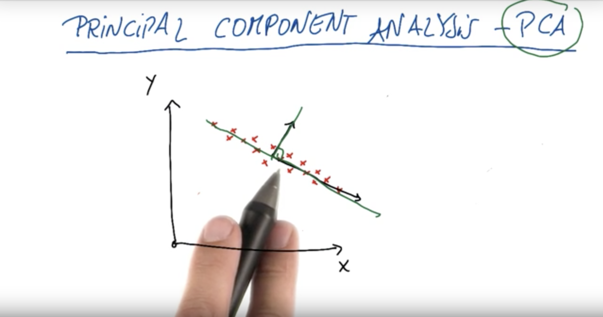
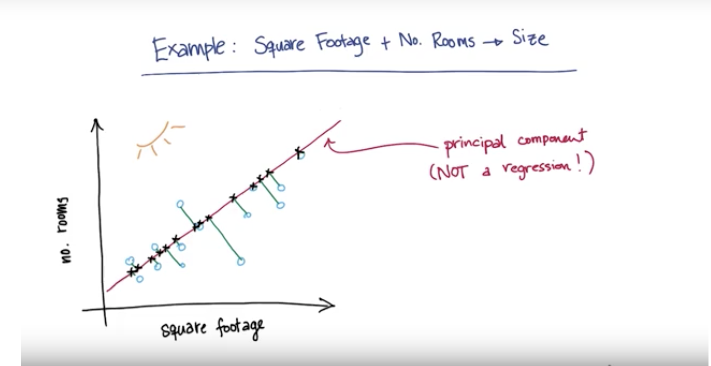
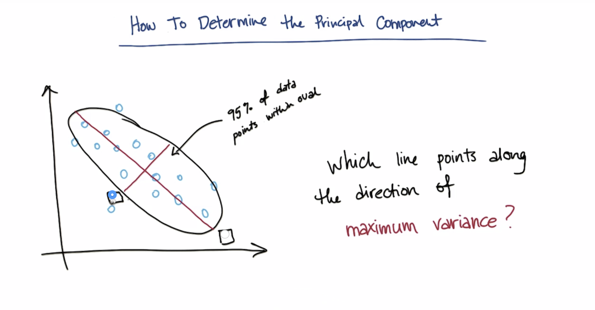
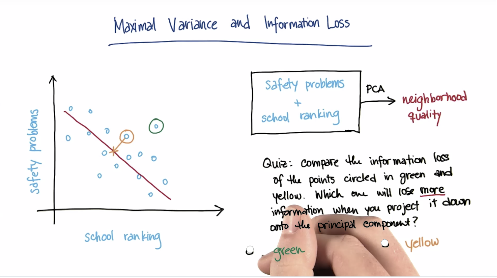

# Principal Component Analysis - PCA

PCA - if you are given data of any shape PCA finds a new coordinate system by translation and rotation it moves the x-axis into the most variation of the data points. 

 

essentially we create to vectors at the center of the data which are orthognal to each other.This is known as a transformation. Given two vectors $\vec{y}$ and $\vec{x}$ we must ensure that at some new point $P$ these vectors our orthognal $\vec{y} \perp \vec{x}$

## Measurable vs. Latent Features

question: given the features of a house, what is its price? this is a classic regression exercise so it's a conyinous which is a number as an output. 

** Measurable ** 
 - square footage 
 - no. of rooms 
 - school ranking 
 - neighborhood safety 

we arre proping two things (size, neighborhood) you can't measure directly but are drvigin the phenomenon behind the scene. 

** Latent ** 
 - size 
 - neighborhood 
 
question: How best to condense our 4 features to 2, so that we really get to the heart of the information? 

What's teh most suitable feature selection tool? 

* SelectKBest 
* SelectPercentile

You want to choose your $k$ number of features you would like to keep.

** Crucial Ingredients ** 
- Many features, but I hypothesize a smaller no. of featurse actually driving the patterns 
- Try making a **composite feature** that more directly probes the underlying phenomednon

## Example: Square Footage + No. Rooms -> Size 

 

Essentially, what is occuring in this image is a projection of that vector by creating new orthognal vectors along the line, creating a transformation of new points along the vector.

### How to determine the principal component. 

** Variance ** - the willingness / felxibility of an algorithm to learn (Machine Learning) 

** Variance (Stats) ** - roughly the "spread" of a data distribution $STD^{2}$. 

 

The longer line is goign to be the direction of maximum variance. ** Principal Component** of the data set is the direction that has thed ** Largest Variance ** because it retains maximum amount of "information" in the orginal data.

### Maximal Variance and information loss 

 
essentially, we want to creat a vector where the distance of the projection onto direction of maximal variance minimizes the distance from old (higher-dimensional) data point to its new transformed value. This in turn minimizes information loss. 

### PCA as a General Algorithm for feature transformation 

